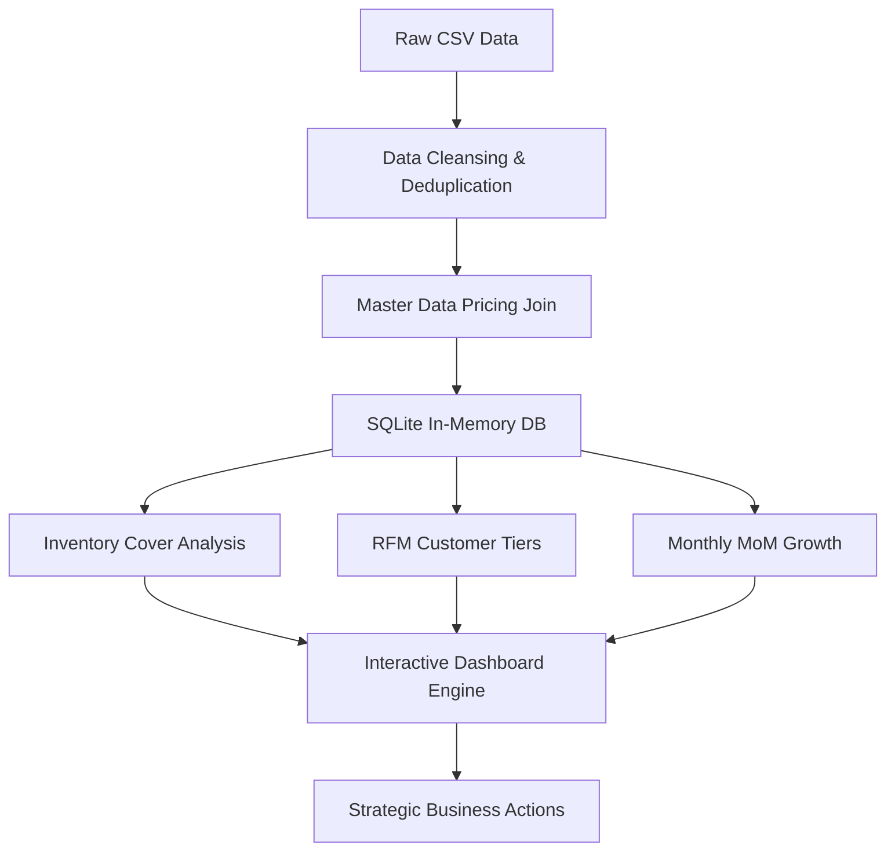

# Retail Sales Analysis & Strategic Dashboard

An end-to-end data intelligence solution to address stagnant retail growth, optimize inventory levels, and target high-value customers using Python, SQLite, and Streamlit.

---

## 📌 Executive Summary
A retail company was experiencing stagnant growth, high inventory costs, and low customer engagement. This project provides a structured data solution to clean historical sales records, segment the customer base on multi-dimensional metrics, optimize inventory cover ratios, and deliver an interactive dashboard for operations and marketing teams.

---

## 🔍 The Data Problem
The company's raw datasets (`sales_transaction.csv`, `customer_profiles.csv`, `product_inventory.csv`) suffered from several critical data quality issues:
1. **Duplicate Sales Transactions:** Multiple duplicate entries inflated transaction volume and revenue projections.
2. **Pricing Anomalies:** The `Price` column in transaction history contained skewed values (by a factor of ~100) compared to the master list.
3. **Missing Demographics:** Missing data in customer attributes (e.g., location gaps) impaired regional segmentation.
4. **Inefficient Inventory Management:** Substantial capital was locked in slow-moving items, while high-demand items faced stockout risks.
5. **Lack of Behavioral Visibility:** No existing metric calculated how often customers purchased or when they were likely to churn.

---

## 🛠️ Solution Approach & Methodology



### 1. Data Cleansing & Normalization
* **Deduplication:** A window function query partitions transactions by unique key elements (`CustomerID`, `ProductID`, `QuantityPurchased`, `TransactionDate`, `Price`) and keeps only the first record.
* **Pricing Correction:** Bypassed the anomalous transaction prices by performing an inner join with the standard master product list (`Products`) and calculating total revenue based on `Products.Price`.
* **Null Imputation:** Handled missing locations in `Customers` by converting them to `'Unknown'` using `COALESCE`.

### 2. Product & Inventory Optimization
* Developed the **`InventoryCoverRatio`** metric:
  $$\text{Inventory Cover Ratio} = \frac{\text{Current Stock Level}}{\text{Total Units Sold}}$$
* Used percentile thresholds ($Q_3$ for Stock and $Q_1$ for Sales) to flag **High Risk - Overstocked** items:
  * **Overstocked:** High current stock (>75th percentile) and low demand (<25th percentile).
  * **Stockout Risk:** Low current stock and high demand.

### 3. Multi-Dimensional Customer Segmentation
* **Value Tiers:** Categorized customers by lifetime spending using percentile thresholds:
  * 💎 **Diamond:** >99th percentile
  * 🥇 **Platinum:** >95th percentile
  * 🥈 **Gold:** >90th percentile
  * 🥉 **Silver:** >75th percentile
  * 🪵 **Bronze:** Remainder
* **Frequency Tiers:** Calculated average days between purchases (`AvgDaysBetweenPurchases`) via SQLite `LAG()` functions, then classified customers as:
  * **Frequent:** Shortest purchase gaps (<33rd percentile)
  * **Regular:** Moderate purchase gaps (<66th percentile)
  * **Infrequent:** Long purchase gaps (>66th percentile)
  * **One-Time Buyers:** Only 1 transaction in history

---

## ⚡ Important Decisions & Architectural Rationale

> [!NOTE]
> **Why SQLite In-Memory Database?**
> We loaded the raw Pandas DataFrames into an in-memory SQLite database (`:memory:`). This enables writing powerful SQL analytics queries (such as CTEs, window functions, and analytics aggregates) directly in Python, giving the speed of local memory with the robustness of SQL.

> [!TIP]
> **Pandas CSV Caching**
> We added a Streamlit cached function (`@st.cache_data`) for CSV loading. The raw CSV data is only read from disk once. When widgets or sliders update, the application reads from memory, making the dashboard load near-instantaneously.

> [!IMPORTANT]
> **Decoupled Pricing Model**
> We chose to calculate all revenue metrics using the standardized prices from `product_inventory.csv` instead of `sales_transaction.csv`. This decision bypassed the pricing anomaly that skewed the raw transaction revenue by a factor of 100, restoring data integrity.

---

## 🎮 Dashboard Usage & Features

The dashboard consists of five interactive sections accessible from the sidebar navigation:

### 1. Executive Summary
* Provides a high-level overview of methodology, metrics, and key recommendations.

### 2. Product & Inventory Analysis
* Renders a bar chart of top products by revenue and category.
* Visualizes the **Inventory Position Matrix** (Scatter plot identifying overstock and stockout quadrants).
* **`Interactive Tool` - Inventory Planner:** Select any product, enter a proposed order quantity, and instantly see the projected inventory cover ratio and whether the order size is optimal.

### 3. Sales Trends
* Plots monthly revenue trends and Month-over-Month (MoM) revenue growth rates to highlight retail seasonality.

### 4. Customer Segmentation
* Displays a revenue distribution treemap and a 2D segment heatmap.
* **`Interactive Tool` - Strategic Outreach:** Look up any Customer ID to view their detailed metrics. Select an email template (VIP Thank-You, Re-engagement, Second Purchase discount) to generate a personalized outreach email based on their profile data.

### 5. Database SQL Sandbox 🗄️
* Run arbitrary SQL queries against the in-memory SQLite database.
* Features drop-down query templates to help quickly view raw tables, filter datasets, or calculate advanced metrics.
* Download query results instantly as `.csv` files.

---

## 🚀 Setup & Execution

### 1. Requirements
* Python 3.10+
* Required packages listed in [requirements.txt](file:///E:/Data%20cohort/sales_case_study/requirements.txt).

### 2. Quick Start
Run the following commands in your terminal:

```powershell
# 1. Activate the virtual environment
.venv\Scripts\Activate.ps1

# 2. Run the Streamlit Dashboard
streamlit run main.py
```

After running, Streamlit will print the local URL (typically `http://localhost:8501`) where you can view and interact with the application.
